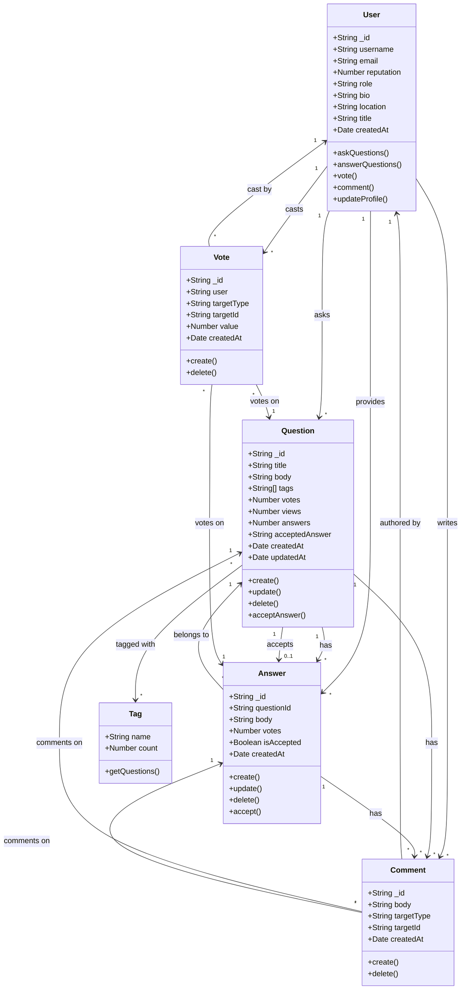

# Design - UML Class Diagram

## Overview
This document contains the UML class diagram representing the data model and relationships for the DevFlow Q&A Platform.

## UML Class Diagram

## Class Descriptions

### User
Represents a user in the system. Users can have different roles (student, expert, admin) and can ask questions, provide answers, vote, and comment.

**Key Attributes:**
- `_id`: Unique identifier
- `username`: User's display name
- `email`: User's email address
- `role`: User's role (student, expert, admin)
- `reputation`: User's reputation score
- `bio`, `location`, `title`: Optional profile information

### Question
Represents a question posted by a user. Questions can have tags, receive votes, and have multiple answers.

**Key Attributes:**
- `_id`: Unique identifier
- `title`: Question title
- `body`: Question content
- `tags`: Array of tag strings
- `votes`: Total vote count
- `views`: Number of views
- `answers`: Number of answers
- `acceptedAnswer`: ID of accepted answer (optional)

### Answer
Represents an answer to a question. Answers can be accepted by the question asker and receive votes.

**Key Attributes:**
- `_id`: Unique identifier
- `questionId`: Reference to parent question
- `body`: Answer content
- `votes`: Total vote count
- `isAccepted`: Whether this answer is accepted

### Vote
Represents a vote (upvote or downvote) on a question or answer.

**Key Attributes:**
- `_id`: Unique identifier
- `user`: User who cast the vote
- `targetType`: Type of target ('question' or 'answer')
- `targetId`: ID of the target question or answer
- `value`: Vote value (1 for upvote, -1 for downvote)

### Comment
Represents a comment on a question or answer.

**Key Attributes:**
- `_id`: Unique identifier
- `body`: Comment content
- `author`: User who wrote the comment
- `targetType`: Type of target ('question' or 'answer')
- `targetId`: ID of the target question or answer

### Tag
Represents a tag used to categorize questions.

**Key Attributes:**
- `name`: Tag name
- `count`: Number of questions using this tag

## Relationships

1. **User → Question (1 to Many)**: A user can ask multiple questions
2. **User → Answer (1 to Many)**: A user can provide multiple answers
3. **User → Vote (1 to Many)**: A user can cast multiple votes
4. **User → Comment (1 to Many)**: A user can write multiple comments
5. **Question → Answer (1 to Many)**: A question can have multiple answers
6. **Question → Answer (1 to 0..1)**: A question can have one accepted answer
7. **Question → Comment (1 to Many)**: A question can have multiple comments
8. **Question → Tag (Many to Many)**: Questions can have multiple tags, tags can be used by multiple questions
9. **Answer → Comment (1 to Many)**: An answer can have multiple comments
10. **Answer → Question (Many to 1)**: An answer belongs to one question

## Design Patterns

- **Repository Pattern**: API service layer abstracts data access
- **Role-Based Access Control (RBAC)**: User roles determine permissions
- **Polymorphism**: Votes and Comments can target different entity types (questions or answers)

## Notes

- The system supports three user roles: **student**, **expert**, and **admin**
- Questions can be pinned (by experts/admins) and verified
- Answers can be verified (by experts/admins) and accepted (by question asker)
- The voting system allows users to upvote or downvote questions and answers
- Comments provide a way to ask for clarification or provide additional context

